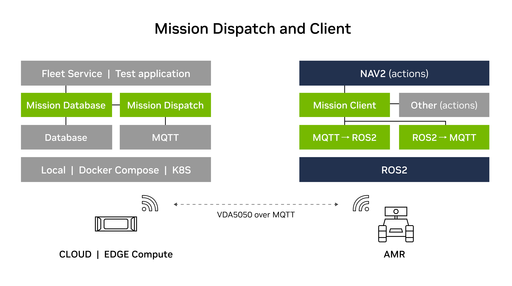
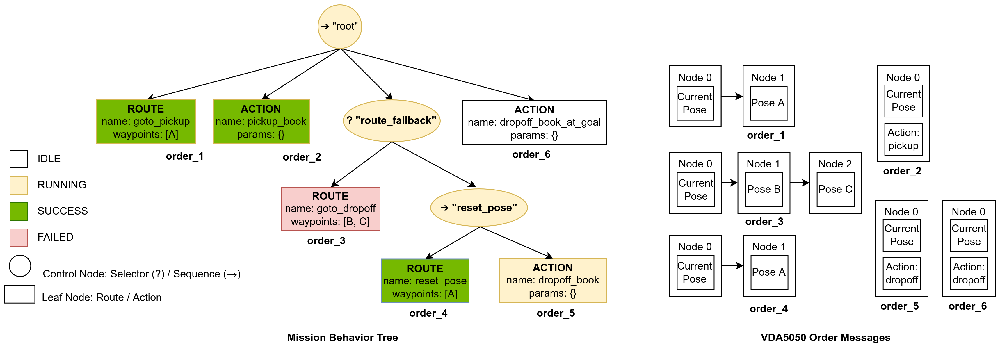
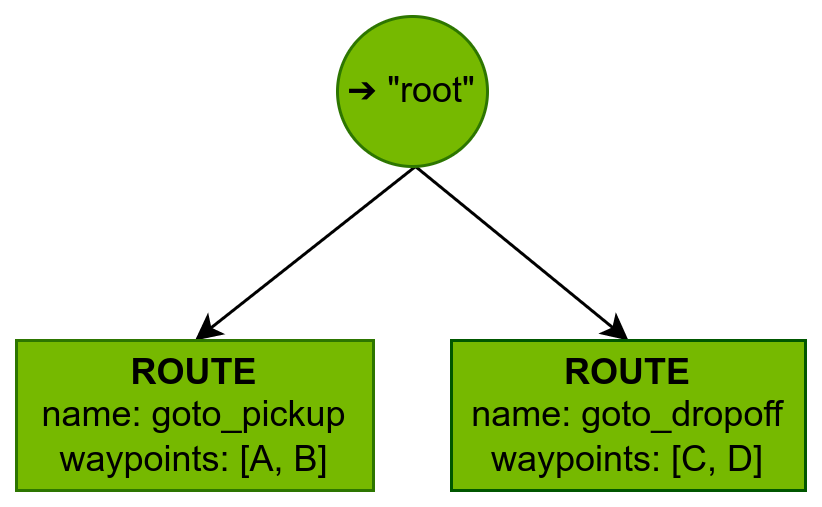

# Isaac Mission Dispatch

## Overview
Isaac Mission Dispatch is a cloud service that enables the communication between edge robots and other cloud services responsible for managing a fleet of robots. The communication between Mission Dispatch and robots is designed per [VDA5050 protocol](https://github.com/VDA5050/VDA5050/blob/main/VDA5050_EN.md) and uses [MQTT](https://mqtt.org/), as MQTT is the industry standard for a highly efficient, scalable protocol for connecting devices over the internet. VDA 5050 is an open standard for communication between fleets of AGVs/AMRs and a central fleet service. 

<div align="center"></div>
<div><i align = "center">Diagram highlighting this package. Mission Dispatch and Client in green. This simplified diagram of a fleet management system on the left is connected to a robot running ROS 2 on the right. References are provided to database and MQTT services. Mission Dispatch needs to be integrated with the fleet management system of preference. A matching ROS 2 <a href="https://github.com/NVIDIA-ISAAC-ROS/isaac_ros_mission_client">Mission Client</a> is available for ROS 2 Humble; or use the <a href="https://github.com/inorbit-ai/ros_amr_interop/tree/galactic-devel/vda5050_connector">VDA5050 connector</a> from OTTO Motors & InOrbit AI on ROS 2 Galactic with Mission Dispatch.</i></div>
<br>

The Mission Dispatch system is composed of two main components:
1. The mission database microservice 

    This component hosts REST APIs used to create, update, watch, and get the state of API mission/robot objects. It also manages persistence for objects, allowing them to rebuild their internal state if they crash or are restarted.
2. The mission dispatch microservice

    This component handles the communication with robots and manages mission state transitions. A mission is defined as a series of tasks needed to be completed by a specific robot. See the [Mission](#mission) section for more details of how a mission maps to VDA5050 orders. 

There are several types of communication between a control service and the fleet of robots, including large data transfers such as map updates to the robot, events recordings from the robot, and high throughput, low latency teleoperation of the robot. Each type is better serviced by other side-channel communication protocols. When a side channel for communication is needed, Mission Dispatch should establish and provide the connection details as it maintains a database for the current state of the system and available robots.

In order for a robot to execute missions, it needs to be a *mission client*. A lightweight mission client simulator is provided to test a simple simulated robot that implements a VDA5050 client (see the [Robot Clients](#robot-clients) section for more details). A mission client node is also available in [ROS 2](https://github.com/NVIDIA-ISAAC-ROS/isaac_ros_mission_client).

In summary, Isaac Mission Dispatch microservices enable fleet management software to submit missions to multiple robots and monitor the robot and mission states. It provides a connection between the robots and the fleet management system but does not handle logistics such as task allocation or conflict resolution, e.g., robots with intersecting paths. The implementation relies [VDA5050 protocol](https://github.com/VDA5050/VDA5050/blob/main/VDA5050_EN.md) as an industry standard between a cloud control service and mobile robots, and uses [MQTT](https://mqtt.org/) as a lightweight, publish-subscribe, machine to machine network protocol designed for devices with resource constraints and limited network bandwidth. 

There are other approaches to distributing tasks to and monitoring a fleet of robots which are available and have their respective benefits and limitations. This solution is one approach to the distributing, and tracking tasks and state from a control service to multiple concurrent robots efficiently with robustness to limited network bandwidth and communication interruption. This solution enables heterogenous robotics stacks in the fleet of robots with [VDA5050 protocol](https://github.com/VDA5050/VDA5050/blob/main/VDA5050_EN.md) for consistent communication. This package provides a part of a fleet management system.

**Note**: Mission dispatch is intended for VDA5050, and no other protocols are supported for now.

## Table of Contents
- [Isaac Mission Dispatch](#isaac-mission-dispatch)
  - [Overview](#overview)
  - [Table of Contents](#table-of-contents)
  - [Latest Update](#latest-update) 
  - [Supported Platforms](#supported-platforms)
  - [Mission](#mission)
    - [What is a Mission](#what-is-a-mission)
    - [How it Works](#how-it-works)
  - [Getting Started with Deployment (Recommended)](#getting-started-with-deployment-recommended)
    - [Deploy with Official Docker Containers](#deploy-with-official-docker-containers)
    - [Deploy with Docker Compose](#deploy-with-docker-compose)
    - [Deploy with Kubernetes](#deploy-with-kubernetes)
  - [Getting Started with Local Development](#getting-started-with-local-development)
    - [Build the Container Locally](#build-the-container-locally)
    - [Launch Mission Dispatch Services Locally](#launch-mission-dispatch-services-locally)
  - [Run Mission Dispatch](#run-mission-dispatch)
    - [Robot Setup](#robot-setup)
        - [Robot Clients](#robot-clients)
            - [VDA5050 Mission Client Simulator](#1-vda5050-mission-client-simulator)
            - [Isaac ROS Mission Client with Isaac Sim](#2-isaac-ros-mission-client-with-isaac-sim)
            - [VDA5050_connector with Gazebo](#3-vda5050_connector-with-gazebo)
        - [Add Robots with REST API](#add-robots-with-rest-api)
    - [Mission Submission](#mission-submission)
        - [Submit Missions with REST API](#submit-missions-with-rest-api)
        - [Examples](#examples)
  - [Additional Resources](#additional-resources)
    - [Isaac ROS Mission Client](#isaac-ros-mission-client)
    - [VDA5050 Connector](#vda5050-connector)
    - [Isaac ROS Troubleshooting](#isaac-ros-troubleshooting)
  - [Updates](#updates)
  - [License](#license)

## Latest Update
Update 2023-10   : Addition of battery status, update/cancel missions, nodePosition, bug fixes.
Update 2022-10-19: Initial release

## Supported Platforms
This package is designed and tested to be compatible with laptops or desktops with [Ubuntu 20.04+](https://releases.ubuntu.com/20.04/) for development, as well as cloud service providers (CSPs) and [EGX](https://www.nvidia.com/en-us/data-center/products/egx/) certified platforms for deployment. 

**Note**: This package does not require GPU acceleration.

## Mission
### What is a Mission
A mission is a series of tasks to be completed by a given robot. It is represented as a behavior tree generated from the `mission_tree`, which is a list of task nodes that may be performed on the robot. The advantage of using a mission tree instead of an array of steps is that it allows the robot to react to all sorts of situations. The behavior tree has an implicit sequence node as its root, which is also named “root”. 

Each mission tree node has four possible states: `IDLE`, `RUNNING`, `SUCCESS`, and `FAILURE`. Currently supported mission tree nodes are: *sequence*, *selector*, *route*, and *action*:

  | Field    | Type               | Parameters                                                                                                                                                         | Description                                                                                                                                                                                                                                                                                 |
  | -------- | ------------------ | ------------------------------------------------------------------------------------------------------------------------------------------------------------------ | ------------------------------------------------------------------------------------------------------------------------------------------------------------------------------------------------------------------------------------------------------------------------------------------- |
  | name     | `Optional[str]`    | None                                                                                                                                                               | A unique name to give the node. If not specified, it will be automatically set to the index of the node in the list                                                                                                                                                                         |
  | parent   | `Optional[str]`    | None                                                                                                                                                               | The parent of the node. If not specified, it will be the “root” node.                                                                                                                                                                                                                       |
  | sequence | `Optional[object]` | None                                                                                                                                                               | Executes children nodes in order. If the child node currently running completes with `SUCCESS`, then the next child node is started. Otherwise, the sequence node completes with `FAILURE`. If all children nodes complete with `SUCCESS`, then the sequence node completes with `SUCCESS`. |
  | selector | `Optional[object]` | None                                                                                                                                                               | Executes children nodes in order. If the child node currently running completes with `SUCCESS`, then the selector node completes with `SUCCESS`. Otherwise, the next child node is started. If all children nodes fail, then the selector node completes with `FAILURE`.                    |
  | action   | `Optional[object]` | `name(string)`: The name of the action to trigger on the robot <br> `params(json)`: An arbitrary, action-specific JSON payload to send as parameters to the action | Performs some generic, named action on the robot.                                                                                                                                                                                                                                           |
  | route    | `Optional[object]` | `waypoints(List[VDA5050NodePosition])`: A list of poses for the robot to visit                                                                                               | Instructs the robot to travel a given route. The robot may or may not visit intermediate waypoints, but the final waypoint must be visited. Will return either `SUCCESS` or `FAILURE`, depending on whether the robot can successfully navigate to the final waypoint.                      |

`VDA5050NodePosition` corresponds to the `nodePosition` data structure in the [VDA5050 protocol](https://github.com/VDA5050/VDA5050/blob/main/VDA5050_EN.md) section 6.7.


The difference between the *sequence* and *selector* node: a *sequence* node will attempt to run all the child nodes as long as `SUCCESS` is being returned and will instantly return `FAILURE` upon a node failing, whereas "selector" will attempt to get only a single `SUCCESS`, and upon failure, will keep trying child nodes until it gets either gets `SUCCESS` or exhausts all child nodes.
 
 **Note**: All mission tree nodes are mutually exclusive -- a sequence node cannot also be a selector node, an action node cannot also be a route node, etc.

### How it Works
Each route or action mission tree node will be translated into a separate VDA5050 Order message. Each of the waypoints in the route mission tree node is an Order node. They are appended together to form an Order message. For the action mission tree node, the action will be attached to the first node of the Order, which is the one corresponding to the current pose of the robot. The Order messages will then be sent out sequentially based on the progression of the behavior tree. An example is shown in the figure below.

<div align="center"></div>

In this example, the mission is shown on the left. The robot is asked to go to a pick-up point and execute the action of picking up a book. After the action is executed successfully, the robot jumps to the next `route_fallback` selector node: if it fails to go to the drop-off point, then it goes back to the previous point and drops off the book; otherwise, it drops off the book at the final goal point. The corresponding VDA5050 Order messages are shown on the right. 

## Getting Started with Deployment (Recommended)

We provide three deployment options here for using Mission Dispatch services: deploy with official Docker containers, deploy with a Docker Compose file, and deploy with Kubernetes. 

Download the repository:

```
git clone https://github.com/NVIDIA-ISAAC/isaac_mission_dispatch
```

Continue here to run Mission Dispatch microservices directly on a computer, CSP, or EGX. Skip to section [Getting Started with Local Development](#getting-started-with-local-development) to develop services locally on your computer.

An interactive documentation page that can be used to submit missions will be launched after the deployment. If you used the default parameters, this can be found at `http://localhost:5000/docs` or `http://<your_ip_address>:5000/docs`. 
### Deploy with Official Docker Containers 
1. Launch Dependencies.

    Mission Dispatch needs a few services to be running to function properly.

- MQTT Broker

    The MQTT broker is used for communication between the Mission Dispatch and the robots. There are many ways to run an MQTT broker, including as a system daemon, a stand alone application, or a docker container. Here we use mosquitto as our MQTT broker. Start the mosquitto broker by running the following:

    ```
    cd isaac_mission_dispatch 
    docker run -it --network host -v ${PWD}/packages/utils/test_utils/mosquitto.sh:/mosquitto.sh -d eclipse-mosquitto:latest sh mosquitto.sh 1883 9001
    ```

- Postgres database

    Set the following environment variable:

    ```
    export POSTGRES_PASSWORD=<Any password>
    ```

    Start the Postgres database by running the following:

    ```
    docker run --rm --name postgres \
      --network host \
      -p 5432:5432 \
      -e POSTGRES_USER=postgres \
      -e POSTGRES_PASSWORD \
      -e POSTGRES_DB=mission \
      -d postgres:14.5
    ```

2. Launch the Mission Database microservice:
    
    Start the API and database server with the official docker container.

    ```
    docker run -it --network host nvcr.io/nvidia/isaac/mission-database:isaac_ros

    # To see what configuration options are, run
    # docker run -it --network host nvcr.io/nvidia/isaac/mission-database:isaac_ros --help
    # For example, if you want to change the port for the user API from the default 5000 to 5002, add `--port 5002` configuration option in the command.
    ```
3. Launch the Mission Dispatch microservice:

    Start the mission dispatch server with the official docker container.

    ```
    docker run -it --network host nvcr.io/nvidia/isaac/mission-dispatch:isaac_ros
    # To see what configuration options are, add --help option after the command.
    ```
### Deploy with Docker Compose 

To simplify the steps in the [Deploy with Official Docker Containers](#deploy-with-official-docker-containers) section, the two dependencies (MQTT broker/Postgres database) and the Mission Dispatch microservices (database/dispatch) are packaged into one Docker Compose file. You can simply run the steps below to achieve the bring up all the microservices:

```
cd isaac_mission_dispatch/docker_compose
docker compose -f mission_dispatch_services.yaml up
# run `docker compose -f mission_dispatch_services.yaml down` if you want to bring down all the services.
```

### Deploy with Kubernetes 

1. Install Kubernetes using [these instructions](/charts/README.md#installing-kubernetes). 

2. Set up the Postgres database:

    a. Set up the Kubernetes Persistent Volume (PV) for the Postgres database:
    ```
    kubectl apply -f https://k8s.io/examples/pods/storage/pv-volume.yaml
    ```
    b. Install the chart for the Postgres database and pass in the primary arguments:
    ```
    helm install postgres-db bitnami/postgresql \
        --set containerPorts.postgresql=5432 \
        --set auth.postgresPassword=postgres \
        --set auth.database=mission \
        --set primary.persistence.storageClass=manual \
        --set volumePermissions.enabled=True \
        --set image.tag=15-debian-11
    ```

2. Set up Mission Dispatch services:

    ```
    cd isaac_mission_dispatch 
    helm install mission-dispatch charts --set hostDomainName=<your_host_doamin_name>
    ```

3. Test with Mission Simulator:

    ```
    docker run -it --network host  nvcr.io/nvidia/isaac/mission-simulator:isaac_ros --robots carter_x,4,5 \
        --mqtt_host <your_host_doamin_name> --mqtt_ws_path /mqtt --mqtt_transport websockets --mqtt_port 80 
    ```

## Getting Started with Local Development
Continue here to develop Mission Dispatch services locally. Skip to the [Run Mission Dispatch](#run-mission-dispatch) section to try our provided services.

### Build the Container Locally

All building and running of applications through bazel
should be done within this container to ensure that the correct dependencies are present. 

```
cd isaac_mission_dispatch 
docker build --network host -t isaac-mission-dispatch "${PWD}/docker"
```

### Launch Mission Dispatch Services Locally
1. Launch Dependencies by following steps in the [Deploy with Official Docker Containers](#deploy-with-official-docker-containers) section.
2. Launch the developer Docker container.

    ```
    docker run -it --rm \
        --network host \
        --workdir "$PWD" \
        -e USER="$(id -u)" \
        -v "$PWD:$PWD" \
        -v /etc/passwd:/etc/passwd:ro \
        -v /etc/group:/etc/group:ro \
        -v "$HOME/.docker:$HOME/.docker:ro" \
        -v "/etc/timezone:/etc/timezone:ro" \
        -v "$HOME/.cache/bazel:$HOME/.cache/bazel" \
        -v /var/run/docker.sock:/var/run/docker.sock \
        -u $(id -u) \
        --group-add $(getent group docker | cut -d: -f3) \
        isaac-mission-dispatch /bin/bash
    ```
    You may run this command in as many terminals as you want to get more terminals in the same developer
environment. A new docker container will be launched for each instance, but they will share the same Bazel cache and source code.

3. Verify with the provided test cases.
    
    Make sure that you are able to build and run the applications in the repo by running the
unit tests within the docker container:
    ```
    bazel test ...
    ```

4. Launch Mission Dispatch microservices.

    Mission Dispatch is comprised of two microservices that are launched independently.

    a. Launch mission database  

    Start the API and database server by using Bazel directly.
    ```
    # Make sure to run step 2 (launch the developer docker container) first
    # in your terminal before running the command below

    bazel run packages/database:postgres -- --db_name mission --db_username postgres \
        --db_password <add_postgres_password> --db_host localhost --db_port 5432

    # Change <add_postgres_password> to a valid postgres password, such as `postgres` or $POSTGRES_PASSWORD if you have set the environment variable before.
    # To see what configuration options are, run
    # bazel run packages/database:postgres -- --help
    ```

    An interactive documentation page that can be used to submit missions will be launched with the Mission Database microservice. 
    If you used the default parameters, this can be found at `http://localhost:5000/docs`, or `http://<your_ip_address>:5000/docs`. 

    b. Launch Mission Dispatch 

    Start the Mission Dispatch server, which will execute missions and populate the robot status in the database.

    ```
    # Make sure to run step 2 (launch the developer docker container) first
    # in your terminal before running the command below

    bazel run packages/controllers/mission

    # To see what configuration options are, run
    # bazel run packages/controllers/mission -- --help
    ```

## Run Mission Dispatch
### Robot Setup
#### Robot Clients
Robot clients are needed to execute the missions. You have three options, depending on your preference:

##### 1. VDA5050 Mission Client Simulator  

The client simulator will simulate a set of robots that will do the following:
- Connect to the MQTT broker.
- Accept missions through VDA5050 and follow the waypoints by moving in an L-shaped path (first $X$, then $Y$).
- Report the updated mission status and robot position back to the server through VDA5050 feedback messages.
- Optionally fail every $N^\text{th}$ mission where $N$ is configurable.

**To run with bazel (self-build container):**
```
# Runs a simulation with two robots
# First robot:
#   name = carter01
#   x position = 4
#   y position = 5
#   theta = 0 (default)
#   failure_period = 0 (default)
#   (A failure period of 0 means the robot will successfully complete all missions)
#
# Second robot:
#   name = carter02
#   x position = 9
#   y position = 9
#   theta = 3.14
#   failure_period = 3
#   (A failure period of 3 means that the 3rd, 6th, 9th... missions will fail,
#    and 1st, 2nd, 4th, 5th... will pass)

bazel run packages/controllers/mission/tests:client -- --robots \
    carter01,4,5 \
    carter02,9,9,3.14,3
```

**To run with docker (official image):**
```
docker run -it --network host nvcr.io/nvidia/isaac/mission-simulator:isaac_ros --robots \
    carter01,4,5 \
    carter02,9,9,3.14,3
```
##### 2. Isaac ROS Mission Client with Isaac Sim 

A ROS 2 Humble package that receives tasks and actions from the fleet management service through Mission Dispatch and updates its progress, state, and errors. It also performs navigation actions with [Nav2](https://navigation.ros.org/) and can be integrated with other ROS actions.

See the tutorials given in the [ROS Mission Client](https://github.com/NVIDIA-ISAAC-ROS/isaac_ros_mission_client) for how to use Mission Dispatch services with ROS Mission Client and [NVIDIA Isaac Sim](https://developer.nvidia.com/isaac-sim).

##### 3. VDA5050_connector with Gazebo

A ROS 2 Galactic package that implements a connector for VDA5050 and works as a bridge between a Mission Dispatch and a ROS 2 robot. It also supports the Nav2 robot navigation stack with other user-defined actions.

Follow the first two steps in the [Running the TB3 adapter](https://github.com/inorbit-ai/vda5050_adapter_examples/blob/galactic-devel/vda5050_tb3_adapter/README.md) to launch the VDA5050_connector with Nav2. Next step is to set the initial pose for Nav2 by clicking the *2D Pose Estimate* button in RViz, and then down clicking on the map in where the robot is in the Gazebo world.

**Note**: if you choose to use VDA5050_connector as a mission client:
- Simply run the Docker Compose file to bring up all the Mission Dispatch microservices:
    ```
    cd isaac_mission_dispatch/docker_compose
    docker compose -f vda5050-adapter-examples.yaml up
    # run `docker compose -f vda5050-adapter-examples.yaml down` if you want to bring down all the services.
    ```
    The IP address of the interactive documentation page `http://<mission_database_ip_address>:5000/docs` can be found through the command: 
    ```
    docker network inspect deployment_vda5050-adapter-examples
    ```
- Set the robot object's name to {serial_number} when post robot and mission. (See the [Add Robots with REST API](#add-robots-with-rest-api) section for more details)
- {manufacturer_name} and {serial_number}  can be found in `vda5050_adapter_examples/vda5050_tb3_adapter/config/connector_tb3.yaml`

#### Add Robots with REST API
The interactive REST API page is used to set up the robot.

Use the `POST /robot` endpoint to create robot objects to represent the robots that will be connected to the mission dispatch. Make sure the names of the robots match the names given to the simulated/real robots.

**Note**: When using the API page, the default value for the robot object's
 `name` in the `spec` is `"string"`, so make sure to change it from `"string"` to another name that has
more meaning (e.g. `"carter01"`). Set the robot object's
 `name` to `{serial_number}` if you choose to use VDA5050_connector as a mission client. 

A request body example for `POST /robot` is shown below:

```
{
  "labels": [],
  "battery": {
    "critical_level": 0.1
  },
  "heartbeat_timeout": 30,
  "name": "carter01"
}
```

Use the `GET /robot` endpoint to query the status of the robots once they are created. If the robots are connected, the state should reflect the actual position of the robots. This endpoint also allows for optional filters which are accessible on the interactive page or through the URL query string if calling the API directly. 
<details><summary>Click for GET /robot filters</summary>

| Filter name       | Effect                                                    | Value |
| ------            | ------                                                    | ------|
|    min_battery    |    Returns robots where `battery_level >= min_battery`    | `float` |
|    max_battery    |    Returns robots where `battery_level <= max_battery`    | `float` |
|    state          |    Returns robots that are in the given state             | `IDLE`, `ON_TASK`, or `MAP_DEPLOYMENT` |
|    online         |    If `true`, returns robots that are online (connected) <br> if `false`, returns robots that are not online (not connected)   | `true` or `false` |
|    names          |    Returns robots where the robot `name` matches a name in the given list   | `array[string]` |
</details>

The video below shows the step-by-step process of how to create and query a robot.

<div align="center"></div>

For more details about the robot object, specifications, and status definition, please refer to the schemas at the end of the interactive REST API documentation page.

### Mission Submission
#### Submit Missions with REST API
Missions can be created using the `POST /mission` endpoint and monitored via the
`GET /mission` endpoint. Users can also monitor the state of a robot through `GET /robot` and watch
its position update as it completes the mission. 

**Note**: By default, the value for the `robot` field in `spec` is `"string"`, so make sure to change it to
the `name` you used for one of the robot objects you created earlier. If you set the `name` of the robot
object to `"carter01"`, use that to fill in the `robot` field for the mission. 

**Note**: A `mission_tree` includes multiple mission nodes. A mission node can only be one of the four node types mentioned in the  [Mission](#mission) section. When sending a mission, a user should choose one and remove the other three in the request body.

This video shows the step-by-step process to create and query multiple missions with multiple robots given in the [Examples](#examples) section.

<div align="center"></div>

Users are allowed to `DELETE` and `CANCEL` a queued mission (submitted but waiting to be executed) at any time. However, if users want to `DELETE` a currently running mission, Mission Dispatch will label the life cycle of the current mission as `PENDING_DELETE`, wait for the current mission to finish, and then delete it. 

Similarly,  if users want to `CANCEL` a currently running mission, Mission Dispatch will set `needs_canceled` in mission specifications to `True`, wait for the current mission to finish, and then cancel the mission. 

This POST /mission/{name}/update endpoint is to update the route nodes within a mission. If updates involving changes to sequence and selector nodes in the mission tree structure are necessary, please cancel the mission and submit it again with the revisions. To update the route node for a mission, users need to provide the mission name and the waypoints of the route in the request body of the POST /mission/{name}/update endpoint. Note that users cannot update a route node that has already been marked as completed.

For more details on the mission object, specifications, and status definition, refer to the schemas at the end of the interactive REST API documentation page.
#### Examples
We provide two `POST /mission` request body examples here as a reference for how to construct a mission tree.

- Example 1 -- Simple mission

<div align="center"></div>

Consider a simple mission where the robot `"carter01"` is asked to go to the pickup point and then move to the drop-off point with certain predefined routes. The sample request body for posting a mission is shown below:

```
{
"robot": "carter01",
"mission_tree": [
    {
    "name": "goto_pickup",
    "parent": "root",
    "route": {
        "waypoints": [
        {
            "x": 1.5,
            "y": 1.5,
            "theta": 0,
            "map_id": "map"
        },
        {
            "x": 3.3,
            "y": 2.1,
            "theta": 0,
            "map_id": "map"
        }
        ]
    }
    },
    {
    "name": "goto_dropoff",
    "parent": "root",
    "route": {
        "waypoints": [
        {
            "x": 4.0,
            "y": 3.2,
            "theta": 0,
            "map_id": "map"
        },
        {
            "x": 5.0,
            "y": 5.0,
            "theta": 0,
            "map_id": "map"
        }
        ]
    }
    }
],
"timeout": 300,
"deadline": "2023-09-28T04:04:24.013Z",
"needs_canceled": false,
"name": "simple_mission_example"
}
```
    
- Example 2 -- Complex mission

<div align="center"></div>

A relatively complex mission will include behavior control nodes such as `sequence` and `selector`, as shown in the mission given in the [mission](#mission) section. We provide the request body example for that mission below. 

In this example, the robot completes the `goto_pickup` and `pickup_book` nodes, then completes the `route_fallback` selector node as the robot can reach the waypoints set in the `goto_dropoff` node. Thus, it would skip the `reset_pose` and `dropoff_book` nodes under the same `route_fallback` selector node. However, the mission fails at the last `dropoff_book_at_goal` node as the `should_fail` parameter for the action is set to `True`. Logging of the mission progression and error messages are displayed in the terminal output as well as on the API page. 

Watch the Submitting Missions video tutorial given in the [Submitting Missions](#submitting-missions) section for how to use the example given here.

```
{
    "robot": "carter01",
    "mission_tree": [
    {
        "name": "goto_pickup",
        "parent": "root",
        "route": {
        "waypoints": [
            {
            "x": 1.5,
            "y": 0.8,
            "theta": 0,
            "map_id": "map"
            }
        ]
        }
    },
    {
        "name": "pickup_book",
        "parent": "root",
        "action": {
        "action_type": "dummy_action",
        "action_parameters": {
            "should_fail": 0,
            "time": 1
        }
        }
    },
    {
        "name": "route_fallback",
        "parent": "root",
        "selector": {}
    },
    {
        "name": "goto_dropoff",
        "parent": "route_fallback",
        "route": {
        "waypoints": [
            {
            "x": 3,
            "y": 2.2,
            "theta": 0,
            "map_id": "map"
            },
            {
            "x": 0.8,
            "y": 1.8,
            "theta": 0,
            "map_id": "map"
            }
        ]
        }
    },
    {
        "name": "goto_dropoff_seq",
        "parent": "route_fallback",
        "sequence": {}
    },
    {
        "name": "reset_pose",
        "parent": "goto_dropoff_seq",
        "route": {
        "waypoints": [
            {
            "x": 1.5,
            "y": 0.8,
            "theta": 0,
            "map_id": "map"
            }
        ]
        }
    },
    {
        "name": "dropoff_book",
        "parent": "goto_dropoff_seq",
        "action": {
        "action_type": "dummy_action",
        "action_parameters": {
            "should_fail": 1,
            "time": 1
        }
        }
    },
    {
        "name": "dropoff_book_at_goal",
        "parent": "root",
        "action": {
        "action_type": "dummy_action",
        "action_parameters": {
            "should_fail": 1,
            "time": 1
        }
        }
    }
    ],
    "timeout": 300,
    "deadline": "2023-09-28T04:04:24.013Z",
    "needs_canceled": false,
    "name": "complex_mission_example"
}
```

**Note**: We provide a dummy action server in our mission client simulator for the user to test the above complex mission. The action parameters include the expected behavior `should_fail` (0: success; 1: failure) and the execution time (in seconds) `time` should be given to simulate a real action server.

## Additional Resources
### Isaac ROS Mission Client
A [ROS mission client package](https://github.com/NVIDIA-ISAAC-ROS/isaac_ros_mission_client) that allows the mission dispatch to communicate with robots through the MQTT protocol. Visit this resource for more video tutorials on using Mission Dispatch with Isaac ROS Mission Client, as well as for [NVIDIA Isaac Sim](https://developer.nvidia.com/isaac-sim) running on local and cloud.

### VDA5050 Connector 
The [vda5050_connector](https://github.com/inorbit-ai/ros_amr_interop/tree/galactic-devel/vda5050_connector) package is another mission client (in ROS 2 Galactic) that provides a set of ROS 2 nodes for connecting a ROS 2-based robot to the Mission Dispatch.

### Isaac ROS Troubleshooting
Check [here](https://github.com/NVIDIA-ISAAC-ROS/isaac_ros_common/blob/main/docs/troubleshooting.md) for solutions to problems with Isaac ROS.

## Updates
| Date       | Changes         |
| ---------- | --------------- |
| 2022-10-19 | Initial release |

## Frequently Asked Questions
* How is the issue of mission persistence exactly addressed?

Tasks assigned to robots are stored in a persistent database in the cloud / edge with Mission Dispatch/Database.  If the robot were to fail it will lose the task, and the behavior tree for the task will inform how Mission Dispatch should handle the failure.  If Mission Dispatch were to fail, the state can be reconstructed from the database, which reflects the known state at the time of failure.

* From a standards perspective, are you following the VDA5050 protocol 100%.

We aim to provide robot control adhering to VDA5050.  There are aspects of the protocol we have not yet needed to implement.  If there are aspects that do not conform, please file an Issue or Pull Request.

* Do you accept Pull Requests.

Yes!


## License
Isaac Mission Dispatch is under [Apache 2.0 license](https://github.com/NVIDIA-ISAAC/isaac_mission_dispatch/blob/release-dp2/LICENSE).

